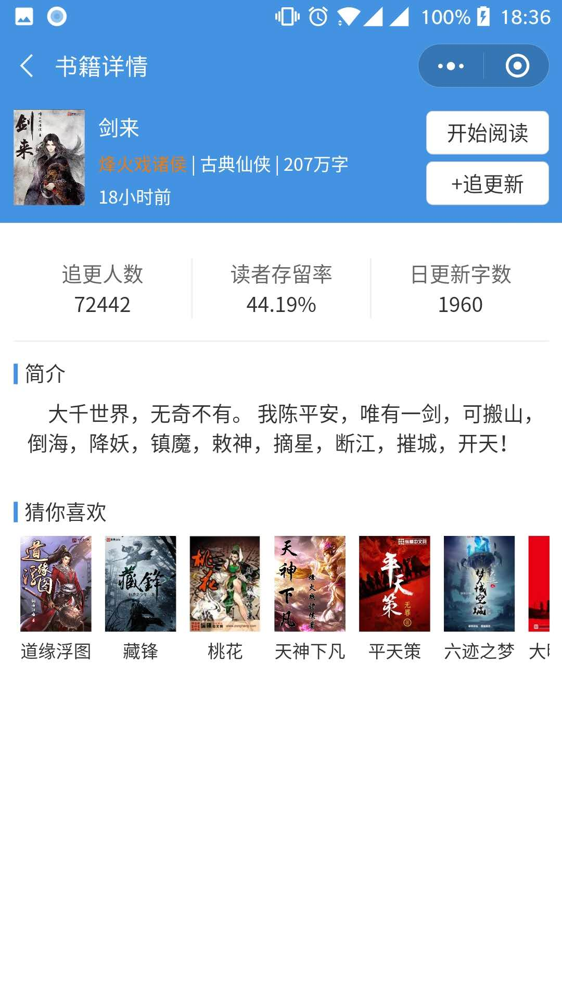
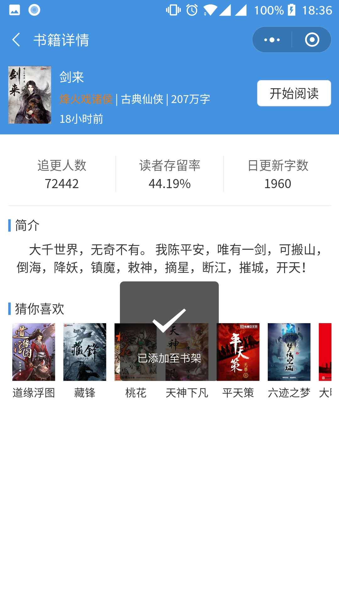
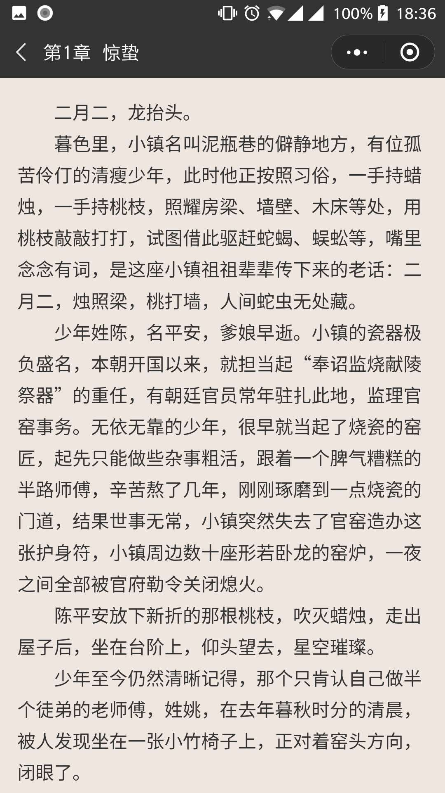
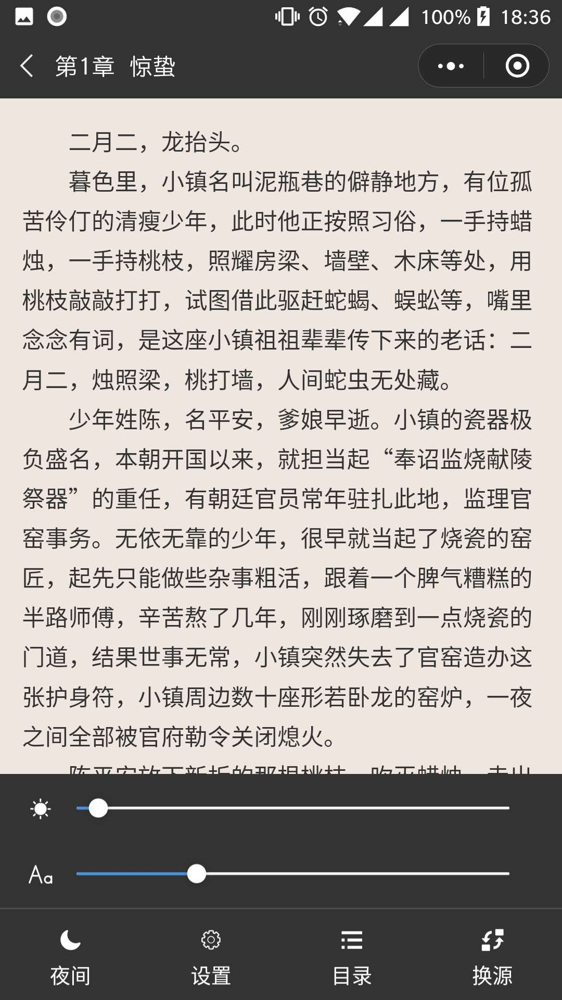
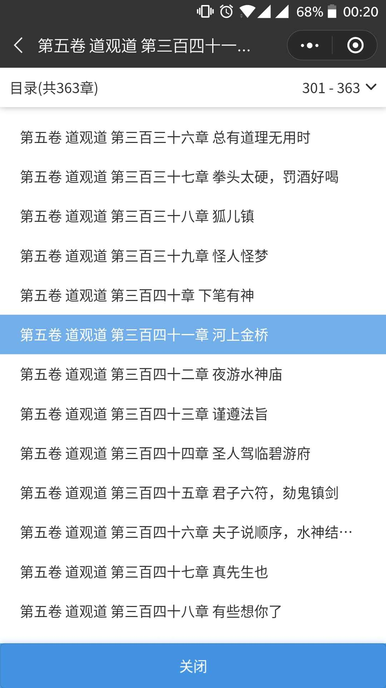
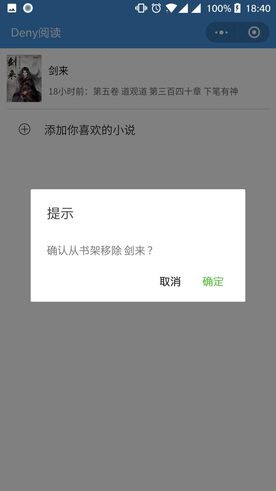

# wx-book

基于mpvue的小说阅读器小程序，已隐去API，数据脱敏，仅供学习交流使用，如有侵权，请及时联系。

## 特性

 1. 搜索小说
 2. 分享小说，最低层级可至指定章节
 3. 阅读小说章节
 4. 追更
 5. 更多。。。

## 命令说明

```bash
 npm start # 启动
 npm run build # 打包
```

## 项目结构说明

```
.
├── dist                     # 打包后的代码，也是实际上传小程序的代码
├── build                    # webpack配置文件
├── config                   # 环境配置文件
├── project.config.json      # 项目配置文件
├── src                      # 程序源文件
│   ├── main.js              # 入口文件
│   ├── components           # 可复用的组件(Presentational Components)
│   ├── styles               # 样式文件
│   ├── store                # Vuex Store文件
│   └── pages                # 页面文件
```

## 效果展示


